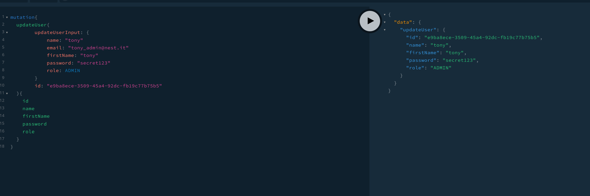

<p align="center">
  <a href="http://nestjs.com/" target="blank"></a>
</p>


## Description

setup project 

## Installation

```bash
$ npm install
$ yarn install
```

#### run graphql typings

```bash
$ yarn generate-typings
```

## Update env file with your database credentials

```bash
    POSTGRES_HOST=localhost
    POSTGRES_USER=postgres
    POSTGRES_PASSWORD=postgrespw
    POSTGRES_DB=postgres
    POSTGRES_PORT=32768
    PGADMIN_DEFAULT_EMAIL=admin@admin.com
    PGADMIN_DEFAULT_PASSWORD=admin
```

## Init the database with file in folder 

**_scripts/db/db_init.sql_**

#### run  docker compose for postgres instance if you want to use it

```bash
$ docker-compose up -d
```

#### run  docker compose for pgadmin instance if you want to use it

```bash
$ docker-compose -f docker-compose.pgadmin.yml up -d
```

## Installation

```bash
$ npm install
```

## Running the app

```bash
# development watch mode with hot reload
$ yarn dev
```

## Test

```bash
# unit tests
$ yarn test

# e2e tests
$ yarn test:e2e

# test coverage
$ yarn test:cov
```

users query


users mutation



test 


- Author - [Coulibaly mamadou]
